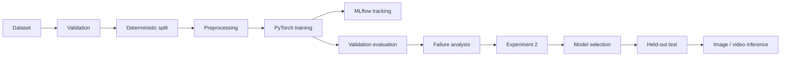
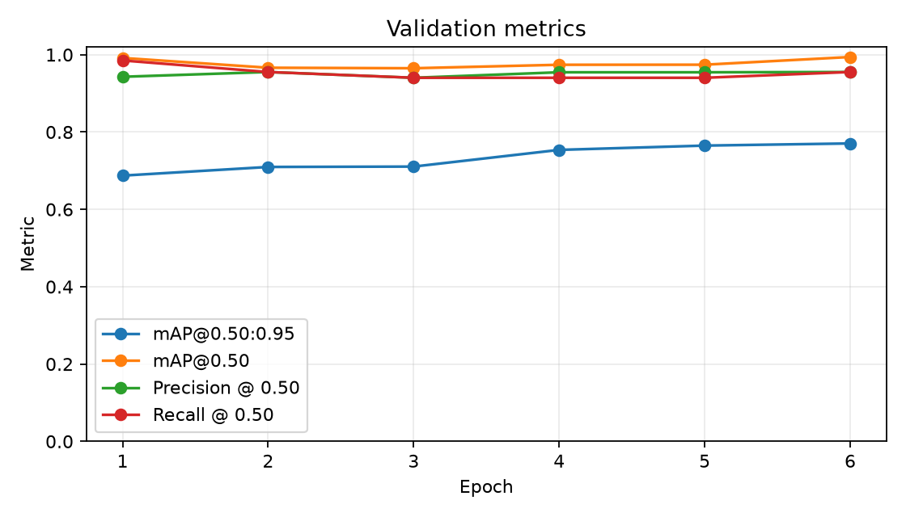
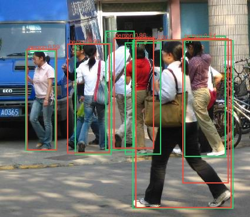
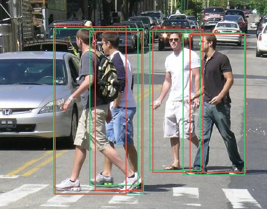

# PyTorch Object Detection & Failure Analysis Pipeline

[](https://pytorch.org/)
[](https://github.com/leafyve/pytorch-object-detection-failure-analysis/actions/workflows/ci.yml)
[](https://leafyve.github.io/pytorch-object-detection-failure-analysis/)

A reproducible computer-vision project that fine-tunes **Faster R-CNN MobileNetV3
Large FPN** on real Penn-Fudan street images, evaluates COCO mAP on held-out data,
turns false positives and false negatives into structured evidence, and uses those
validation failures to motivate a second experiment. The workflow is implemented as
a tested PyTorch package and CLI—not a training notebook—and includes local MLflow,
OpenCV video inference, Docker, CI, and a static experiment report.

## Key results

| Evidence | Result |
|---|---:|
| Dataset | 170 images / 423 mask-derived pedestrian instances |
| Deterministic split | 119 train / 25 validation / 26 test images |
| Selected model | Faster R-CNN MobileNetV3 Large FPN, COCO transfer learning |
| Baseline validation mAP@0.50:0.95 | 0.7705 |
| Improved validation mAP@0.50:0.95 | **0.7913** (+0.0208) |
| Final test mAP@0.50:0.95 | **0.6850** |
| Final test mAP@0.50 | **0.8937** |
| Final test precision / recall | **0.9219 / 0.8939** |
| Final test counts at threshold 0.45 | 59 TP / 5 FP / 7 FN |

The final test was run once after the improved checkpoint and confidence threshold
were frozen from validation evidence. The lower test result is reported without
retuning.

## Project overview

The package handles safe dataset acquisition, deterministic splitting, transfer
learning, checkpoint resume, local experiment tracking, COCO-style evaluation,
threshold selection, structured failure analysis, model selection, and image/video
inference. Generated JSON and CSV artifacts keep the scientific claims traceable to
executed code.

## Why this project exists

Object-detection demos often stop at a loss curve or a single mAP value. This project
focuses on the engineering work around the model: protecting the test split,
reproducing experiments, distinguishing confidence errors from localization errors,
preserving artifacts, handling malformed inputs, and making an intervention only
after inspecting validation failures.

## Architecture



The reusable code lives in `src/podfa`; scripts only parse CLI arguments and call the
package. Training, evaluation, and inference reconstruct the same model through one
factory and validate checkpoint architecture metadata before loading weights.

## Dataset

Penn-Fudan contains outdoor pedestrian scenes from the University of Pennsylvania
and Fudan University. `scripts/download_data.py` downloads the ZIP from the same
[UPenn source used by the official Torchvision tutorial](https://www.cis.upenn.edu/~jshi/ped_html/PennFudanPed.zip),
checks ZIP integrity and path safety, validates all 170 image/mask pairs, refuses to
overwrite an incomplete destination, and records source URL, time, and archive hash.

The current archive contains 423 mask instance IDs across 170 images (119/25/26
images and 290/67/66 instances in train/validation/test). Some older descriptions,
including the Torchvision tutorial, state 345 labeled pedestrians; this repository
reports the count parsed from the downloaded masks used in these runs.

The upstream download page does not publish an explicit redistribution license.
This repository therefore attributes the University of Pennsylvania and Fudan
University source, downloads data directly from UPenn, and does not redistribute raw
images. Review the source terms before commercial use.

## Model

- `torchvision.models.detection.fasterrcnn_mobilenet_v3_large_fpn`
- COCO `DEFAULT` pretrained weights (`COCO_V1` in run metadata)
- classification head replaced with two outputs: background and person
- 18,871,333 trainable parameters
- automatic CUDA → MPS → CPU device selection
- SGD, momentum 0.9, weight decay 0.0005, StepLR at epoch 3
- CUDA automatic mixed precision; CPU execution remains supported

The lightweight MobileNetV3/FPN backbone makes two complete local experiments
practical while preserving the two-stage detector and multi-scale feature story.

## Training methodology

Seed 42 fixes Python, NumPy, PyTorch, data shuffling, and split membership.
Torchvision's CUDA ROI Align backward kernel is not deterministic in PyTorch 2.5.1;
the pipeline requests deterministic behavior with warnings and records this limit.

Both experiments used six epochs and batch size 2 on an RTX 4050 Laptop GPU. The
best checkpoint was selected exclusively by validation mAP@0.50:0.95. Each run saved
configuration, environment, history, architecture, seed, manifest/config hashes,
optimizer/scheduler/scaler state, runtime, device, and MLflow run ID. Atomic latest
and best checkpoints support interruption recovery and `--resume`.

## Evaluation methodology

COCO AP is confidence-independent and comes from `pycocotools`. Operating precision,
recall, TP, FP, and FN use score-ordered one-to-one matching at IoU 0.50. The
confidence threshold is selected on validation by maximum F1, with recall, precision,
then threshold as tie-breakers.

The test manifest is never used by training, threshold selection, or experiment
selection. `artifacts/model_selection.json` freezes the checkpoint hash and threshold
before `artifacts/final_test_metrics.json` is produced.

## Baseline experiment

Baseline resize: 512–768 px. Best epoch: 6. Training duration: 152.872 s.
MLflow run: `fbdbeccc1f55403aada2cf94d696685c`.

| Validation metric | Baseline |
|---|---:|
| mAP@0.50:0.95 | 0.7705 |
| mAP@0.50 | 0.9940 |
| Precision | 0.9559 |
| Recall | 0.9701 |
| TP / FP / FN | 65 / 3 / 2 |
| Selected threshold | 0.30 |



## Failure analysis

The baseline generated `reports/validation_failures.csv` and an annotated gallery.
At threshold 0.30 it recorded three localization-category false positives, two false
negatives, and two geometrically correct low-confidence detections.

The two misses were highly occluded pedestrians in groups. Their candidate boxes had
IoU 0.893 and 0.595 but scores of only 0.069 and 0.066. Visual review also showed that
several high-confidence “localization” errors fall on overlapping or partially
annotated pedestrians—an annotation-scope limitation that threshold tuning cannot
cleanly solve.



Failure categories are deterministic and machine-readable:

- unmatched high-score boxes with IoU 0.10–0.50: localization failures;
- boxes on an already claimed ground truth: duplicates;
- unrelated unmatched boxes: false positives;
- unmatched ground truth: false negatives;
- correct boxes below the operating threshold: low-confidence correct detections.

## Improvement experiment

Experiment 2 made one intervention: raise resize bounds from 512–768 to 640–960 px
to preserve detail for the occluded validation misses. Architecture, weights, split,
augmentation, optimizer, schedule, batch size, epochs, and seed stayed fixed.

| Metric | Baseline | Improved | Delta |
|---|---:|---:|---:|
| mAP@0.50:0.95 | 0.7705 | **0.7913** | +0.0208 |
| mAP@0.50 | **0.9940** | 0.9768 | -0.0172 |
| Precision | 0.9559 | 0.9559 | 0.0000 |
| Recall | 0.9701 | 0.9701 | 0.0000 |
| TP / FP / FN | 65 / 3 / 2 | 65 / 3 / 2 | unchanged |

The change improved the selection metric but did not fix the operating-count failure
cases. It also reduced AP@0.50, so the result is mixed rather than a universal win.
The improved run took 147.351 s and selected epoch 4 at threshold 0.45. Full evidence
is in `reports/experiment_comparison.md`.

## Final held-out test results

Exactly one final evaluation was run on the 26-image/66-instance test partition using
checkpoint SHA-256 `9978477659599ffab35279f3ad81b0800bf8e0e7cf2b1c89ec7029d797291d8e`
and validation-selected threshold 0.45.

| Test metric | Result |
|---|---:|
| mAP@0.50:0.95 | 0.6850 |
| mAP@0.50 | 0.8937 |
| Precision | 0.9219 |
| Recall | 0.8939 |
| F1 | 0.9077 |
| TP / FP / FN | 59 / 5 / 7 |



## Video inference

`scripts/predict_video.py` decodes frames with OpenCV, uses the same checkpoint
loader and automatic device selection, draws person boxes/scores plus per-frame
inference FPS, and atomically writes the annotated video. It fails without leaving a
partial output when a video is unreadable. A local ten-frame CUDA smoke run processed
all frames at 14.859 measured inference FPS; this is a smoke measurement, not a
general throughput benchmark.

```bash
python scripts/predict_video.py \
  --config configs/improved.yaml \
  --checkpoint path/to/best.pth \
  --input local-video.mp4 \
  --output annotated.mp4 \
  --threshold 0.45
```

No video file is committed.

## Reproduction instructions

Python 3.10–3.12 is supported; Python 3.11 was used here. Install the appropriate
PyTorch build for the machine first, then the package:

```bash
python -m venv .venv
# Linux/macOS: source .venv/bin/activate
# Windows PowerShell: .venv\Scripts\Activate.ps1
python -m pip install --upgrade pip
python -m pip install torch==2.5.1 torchvision==0.20.1
python -m pip install -e ".[dev]"
python scripts/download_data.py --data-dir data/raw
python scripts/create_splits.py
python scripts/train.py --config configs/baseline.yaml
python scripts/evaluate.py --config configs/baseline.yaml \
  --checkpoint artifacts/experiments/baseline/checkpoints/best.pth \
  --split validation --output-dir artifacts/experiments/baseline/validation \
  --select-threshold
```

Run `python scripts/train.py --config CONFIG --resume CHECKPOINT` to resume a matching
architecture/class-count checkpoint.

## MLflow usage

Runs are stored locally in `mlruns/mlflow.db`; artifacts remain under `mlruns/artifacts`.

```bash
mlflow ui --backend-store-uri sqlite:///./mlruns/mlflow.db
```

Open <http://127.0.0.1:5000> to compare parameters, per-epoch losses/metrics, duration,
device, seed, and artifacts. No paid or hosted account is required.

## Docker

The image installs CPU PyTorch, runs as a non-root user, and excludes datasets,
checkpoints, MLflow storage, and secrets.

```bash
docker build -t podfa:local .
docker run --rm podfa:local
docker run --rm -v "$PWD/data:/data" -v "$PWD/artifacts:/artifacts" podfa:local \
  pytest -q
```

The supplied image is CPU-first. For NVIDIA training, use an NVIDIA CUDA PyTorch base
image and the NVIDIA Container Toolkit, or train in the host CUDA environment used for
these experiments.

## Testing

```bash
ruff check .
pytest -q
python scripts/validate_install.py
```

Tests cover dataset acquisition/loading, split reproducibility and leakage, box and
transform validation, real detector inference/training forwards, matching/COCO
metrics, failure precedence, thresholds, checkpoints, MLflow, malformed media,
configuration, image inference, and video inference. CI runs the normal suite, an
explicit real-detector smoke, the install smoke, and a Docker build—never full
training.

## Repository structure

```text
configs/                 baseline, improved, and smoke experiments
scripts/                 download, split, train, evaluate, analyze, infer
src/podfa/
  data/                  integrity, manifests, dataset, paired transforms
  models/                detector factory and checkpoint reconstruction
  training/              engine, atomic checkpoints, MLflow, pipeline
  evaluation/            matching, COCO metrics, failures, plots, comparison
  inference/             image and OpenCV video paths
tests/                   fast unit/integration and model smoke tests
artifacts/               small JSON/CSV evidence; large checkpoints ignored
reports/                 comparison and structured validation failures
docs/                    static portfolio report and generated figures
```

## Limitations

- Penn-Fudan is small, single-class, geographically narrow, and visually dated.
- Many distant or occluded pedestrians are outside the mask labels, complicating FP
  interpretation.
- Validation and test estimates have high variance because each split is small.
- The detector is not calibrated for safety-critical surveillance decisions.
- The 14.859 FPS smoke result is one repeated-image clip on one RTX 4050 laptop, not a
  deployment benchmark.
- PyTorch 2.5.1 CUDA ROI Align backward is not fully deterministic.
- Faces and people imagery create privacy, consent, bias, and misuse risks.

## Future work

- repeat with multiple seeds or cross-validation;
- add data from diverse cameras, weather, geography, and body presentation;
- audit annotations and create an explicit ignore-region policy;
- calibrate scores and slice metrics by size/occlusion;
- benchmark SSDLite or an optimized exported detector for real-time video;
- add drift monitoring and human review before any operational use.

See [MODEL_CARD.md](MODEL_CARD.md), [RESUME_EVIDENCE.md](RESUME_EVIDENCE.md),
[INTERVIEW_NOTES.md](INTERVIEW_NOTES.md), and the
[static project report](docs/index.html).
